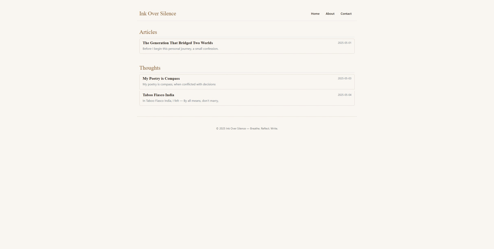

# 📝 Ink Over Silence

Welcome to my digital notebook — where thoughts crystallize into words, code intersects with contemplation, and ideas find their rhythm.

## 🧠 Philosophy

A deliberately minimalist space:  
**No trackers** · **No bloat** · **Just authentic expression**  

Built for:  
✦ Reflection over analytics  
✦ Substance over spectacle  
✦ Honest sharing over optimization  

## ⚙️ Technical Essence

A custom-built static generator that embodies its philosophy:

```text
Final Output:  Pure HTML/CSS
Build Tool:    Node.js (build-time only)
Deployment:    What You See Is What You Get
```

---
---

## 🖼️ Blog Preview


*Current homepage design - last updated 2025-05-04*

---


## 📁 Project Structure

        📄 README.md — 📘 Project documentation</br>
        📁 articles/ — 📰 Processed HTML articles</br>
        📁 assets/ — 🎨 Static assets (CSS, fonts, images)</br>
        📄 build.js — 🛠️ Build script to generate static html from marked files</br>
        📁 content/ — ✍️ Markdown blog posts with resp folder</br>
        📄 index.html — 🏠 Homepage entry point</br>
        📄 package.json — 📦 Project metadata and dependencies</br>
        📄 package-lock.json — 🔐 Dependency lockfile</br>

---

## 🚀 Getting Started

### 1. Clone & Install dependencies

```bash
git clone https://github.com/MadhukarMoogala/madhukarmoogala.github.io.git
cd  madhukarmoogala.github.io # change this to yourname.github.io
npm install --registry https://registry.npmjs.org # hard wire registry to avoid private npm repos.
```

### 2. Build the site

This command reads the content from content/, processes it, and outputs the site to public/.

```bash
node build.js
```

### 3. Serve locally (optional)

If you want to preview the blog locally, you can use any static server:

```bash
npx serve
```

---

### 📂 Content Structure

```text
content/
├── articles/    # Long-form essays
├── thoughts/    # Short reflections
└── poetry/      # Formatted verse
```

### ✨ Frontmatter Template

```markdown
---
title: "Your Post Title"     # Required
date: "YYYY-MM-DD"          # Required
abstract: "Brief preview"   # Appears in listings
type: "poetry"              # Optional: "article"|"thought"|"poetry"
tags: [tag1, tag2]          # Optional categorization
draft: false                # Hide when true
---
```

### 🛠️ Usage

1. **New Post**  

   ```bash
   touch content/articles/new-post.md
   ```

1. **Rebuild**  

   ```bash
   node build.js
   ```

### 🌈 Special Features

| Feature          | How To Activate         |
|------------------|-------------------------|
| Poetry Layout    | `type: poetry`          |
| Draft Mode       | `draft: true`           |

### 📝 Example Post

```markdown
---
title: "Why Static Sites"
date: "2025-05-20"
abstract: "The elegance of pure HTML"
---
```

## The Beauty of Static

No databases, no JavaScript frameworks - just:

1. Fast loading
2. Permanent content
3. Total control

```python
# Even code works
def hello_world():
    print("Like this!")
```

---

## 🎨 Styling

The blog is styled with a minimalist aesthetic inspired by *The Financial Times*, using:

- A soft, readable background

- Elegant serif fonts (e.g., Merriweather, Playfair Display)

- Subtle typographic enhancements

You can customize styles in `public/blog.css`.

---

## 📦 Dependencies

This project can be extended using:

- [`marked`](https://www.npmjs.com/package/marked) — Markdown parser

- [`fs-extra`](https://www.npmjs.com/package/fs-extra) — File system utilities

- [`gray-matter`](https://www.npmjs.com/package/gray-matter) — For parsing frontmatter

These are examples — your actual dependencies may differ depending on your implementation.

---

## 📄 License

MIT License © 2025 Madhukar Moogala
